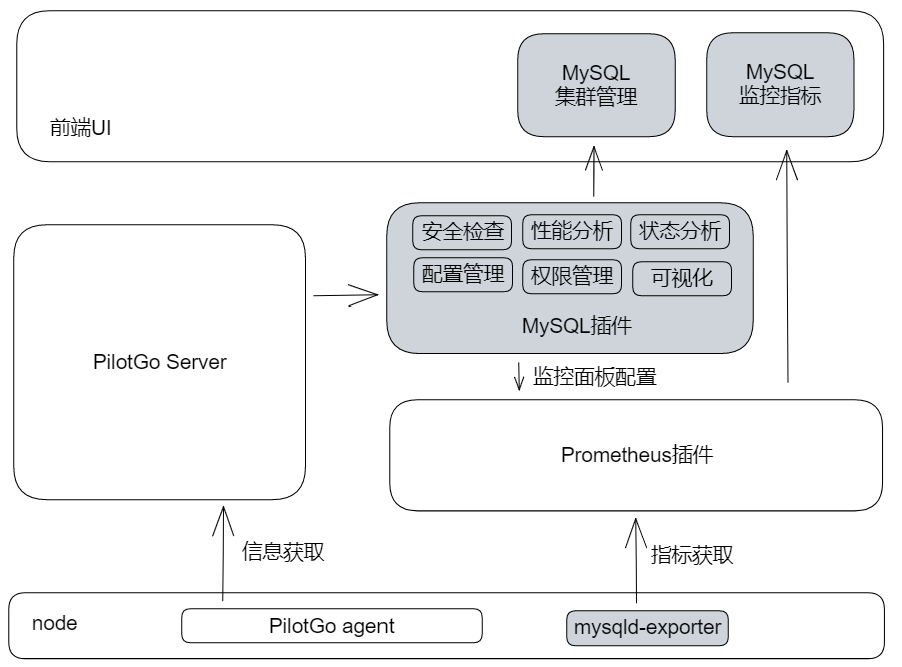

# PilotGo-plugin-mysql

#### Introduction
PilotGo MySQL application plugin, providing functions such as monitoring, management, security analysis and optimization suggestions for MySQL instances.

The MySQL plugin is based on [mysqld-exporter](https://github.com/prometheus/mysqld_exporter) to provide basic monitoring data collection, and also provides functions such as MySQL cluster inspection, security check, performance analysis and running status analysis, ensuring the stable operation of business clusters.

*note*: The PilotGo MySQL plugin runs depending on the PilotGo main platform. For how to use the plugin in the PilotGo platform, please refer to the PilotGo platform documentation.

#### Software Architecture

#### Installation Tutorial

1. Install and run the PilotGo MySQL plugin service
2. Import the MySQL plugin application in the PilotGo platform
3. Use the MySQL plugin functions

#### Supplementary Links
1.  [PilotGo User Manual](https://gitee.com/openeuler/docs/tree/master/docs/zh/docs/PilotGo/使用手册.md)
2.  PilotGo [Code Repository](https://gitee.com/openeuler/PilotGo)
3.  PilotGo [Package Repository](https://gitee.com/src-openeuler/PilotGo)

#### Usage Instructions

1.  xxxx
2.  xxxx
3.  xxxx

#### Contributing

1. Fork this repository
2. Create a Feat_xxx branch
3. Commit your code
4. Create a Pull Request with a detailed description of the implementation
