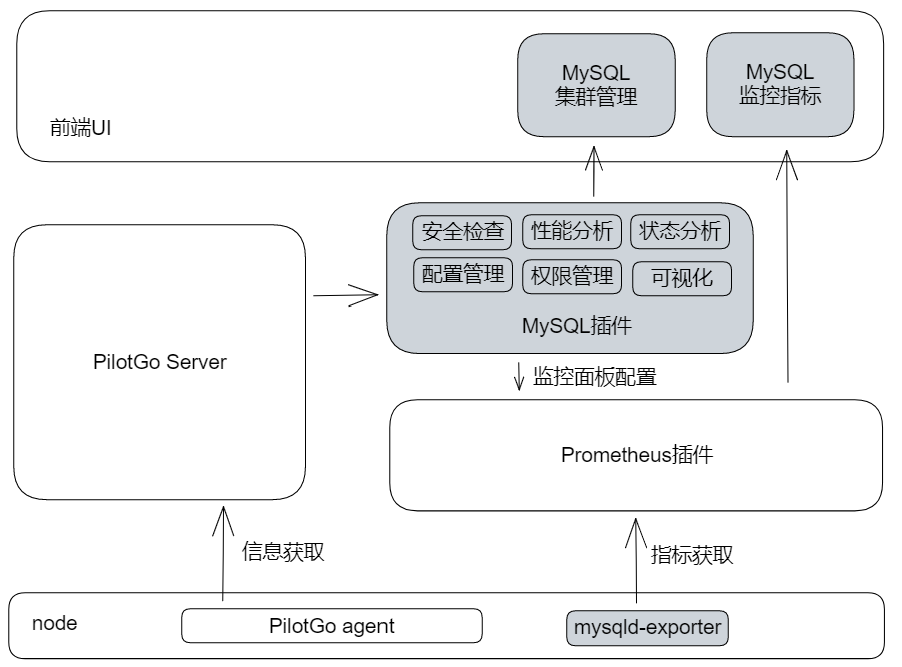

# PilotGo-plugin-mysql

#### 介绍
PilotGo MySQL应用插件，提供MySQL实例的监控、管理、安全分析及优化建议等功能。

MySQL插件基于[mysqld-expoter](https://github.com/prometheus/mysqld_exporter)提供基本的监控数据采集，同时提供MySQL集群巡检、安全检查、性能分析、运行状态分析等功能，保障业务集群的稳定运行。

*note*：PilotGo MySQL插件运行依赖PilotGo主平台，如何在PilotGo平台中使用插件，请参考PilotGo平台文档。

#### 软件架构

#### 安装教程

1. 安装并运行PilotGo MySQL插件服务
2. 在PilotGo平台导入MySQL插件应用
3. 使用MySQL插件功能

#### 使用说明

1.  xxxx
2.  xxxx
3.  xxxx

#### 参与贡献

1. Fork 本仓库
2. 新建 Feat_xxx 分支
3. 提交代码
4. 新建 Pull Request，提供详细的实现说明
